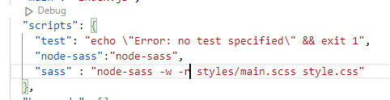

## Extensions 설치 라이브러리

- Prettier -Code for
- scss-lint
- Live Server
- Material Icon Theme
- Framer Syntax 2

## node module 설치

- npm init -y
- https://www.npmjs.com/package/node-sass ( npm i node-sass )
- Command Line Interface 라인찾기 패키지 경로 ( node-sass src/style.scss dest/style.css )

- npm run node-sass , npm run sass (scss >> css 파일 변환)

## SCSS 실시간 반영

- node-sass --watch
  

## 프리티어 설정

## 아이콘 사이트

- https://icomoon.io/app/#/select

## 파비콘 사이트

- https://realfavicongenerator.net/

## Reset.css // Normalize.css

- https://meyerweb.com/eric/tools/css/reset/
- https://necolas.github.io/normalize.css/

## reset 픽

- https://gist.github.com/rohjs/eb269108fefc8e648181c09e3dc662d0
